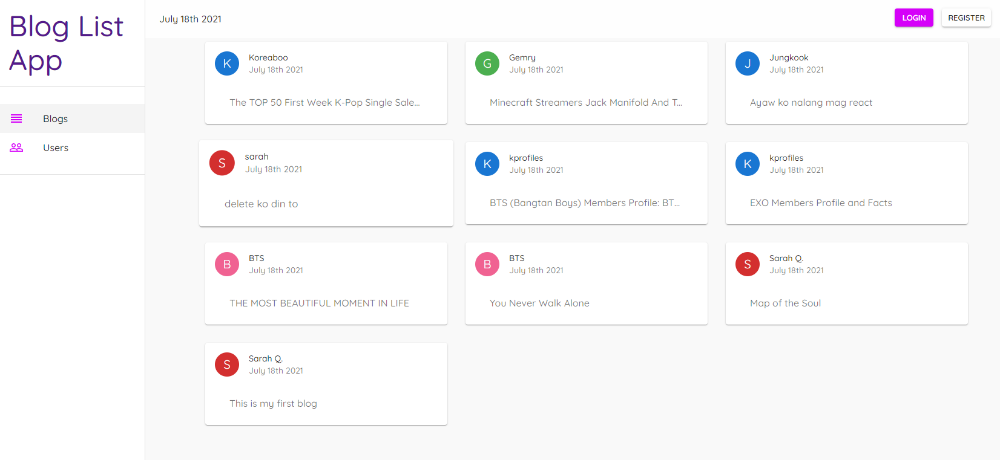

  <h3 align="center">Blog List App</h3>

  

    A blog list app built using MERN + Redux stack
     
    <a href="https://blog-list-app-mern.herokuapp.com/" target="_blank"><strong>View demo »</strong></a>
  

  

    
  

## Built With

### Frontent

- [React](https://reactjs.org/)
- [Redux](https://redux.js.org/)
- [Material-UI](https://material-ui.com/)

### Backend

- [Node](https://nodejs.org/en/)
- [Express](https://expressjs.com/)
- [MongoDB](https://www.mongodb.com/)
- [Mongoose](https://mongoosejs.com/)
- [JWT](https://jwt.io/)
